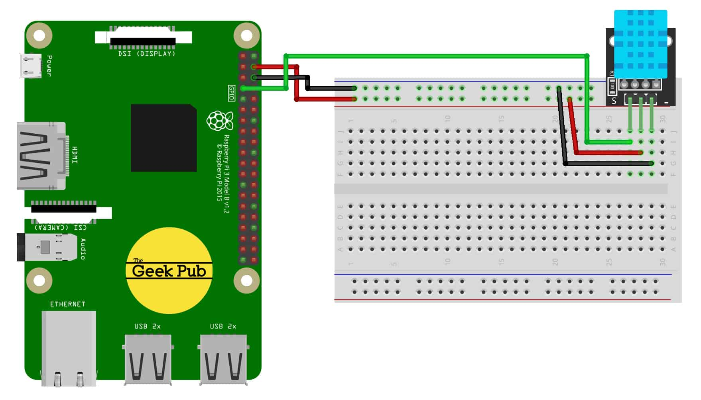

# Greenhouse humidity module

## wire



## Installing CircuitPython Libraries on Raspberry Pi

```bash
$ sudo apt-get update
$ sudo apt-get upgrade
```

```bash
$ sudo pip3 install --upgrade setuptools
# If above doesn't work try
$ sudo apt-get install python3-pip
```

## Set your Python install to Python 3 Default

```bash
$ sudo apt-get install -y python3 git python3-pip
$ sudo update-alternatives --install /usr/bin/python python $(which python2) 1
$ sudo update-alternatives --install /usr/bin/python python $(which python3) 2
$ sudo update-alternatives --config python

$ pip3 install RPI.GPIO
```

## Installing the CircuitPython-DHT Library

```bash
$ pip3 install adafruit-circuitpython-dht
$ sudo apt-get install libgpiod2
```

## upload to greenhouse-test

`rsync -avz humidity.py pi@greenhouse-test:greenhouse/humidity`
