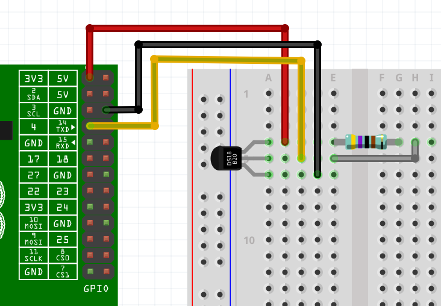

# Greenhouse temperature module

## build

`env GOOS=linux GOARCH=arm GOARM=6 go build`

## upload to greenhouse-test

`rsync -avz temperature pi@greenhouse-test:greenhouse/temperature`

## wire


source: https://raspberry-hosting.com/en/faq/enable-one-wiring-ds18b20-and-ds18s20-digital-thermometer

## Docker

`$ docker build -t temperature . --platform linux/arm/v7`
`docker tag temperature:latest mcpomm/greenhouse-temperature:<tag>`
`$ docker push mcpomm/greenhouse-temperature:<tag>`

## Raspberry

## one wire setup

`$ sudo vi /boot/config.txt`
Add the following line add at the end of the file.

`dtoverlay=w1-gpio,gpiopin=4`

This enables you to handle multiple sensors with a single GPIO pin.(we use GPIO 4)

Then reboot the pi.

Each sensor has a uniq ID. After the rebbot you'll find this id's under:

`$ ls -la /sys/bus/w1/devices/`

```
pi@greenhouse:~ $ ls -la /sys/bus/w1/devices/
total 0
drwxr-xr-x 2 root root 0 Feb 26 23:17 .
drwxr-xr-x 4 root root 0 Feb 26 23:17 ..
lrwxrwxrwx 1 root root 0 Feb 27 15:34 28-01203390917a -> ../../../devices/w1_bus_master1/28-01203390917a
lrwxrwxrwx 1 root root 0 Feb 27 15:34 28-0215c2c3c3ff -> ../../../devices/w1_bus_master1/28-0215c2c3c3ff
lrwxrwxrwx 1 root root 0 Feb 26 23:17 w1_bus_master1 -> ../../../devices/w1_bus_master1
```

You can identify the corresponding ID by connecting the sensors one after another to the GPIO pin 4.
