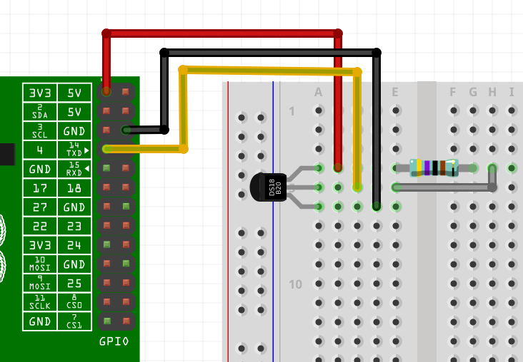

# Greenhouse temperature module

## build

`env GOOS=linux GOARCH=arm GOARM=6 go build`

## upload to greenhouse-test

`rsync -avz temperature pi@greenhouse-test:greenhouse/temperature`

## wire

source: https://raspberry-hosting.com/en/faq/enable-one-wiring-ds18b20-and-ds18s20-digital-thermometer
