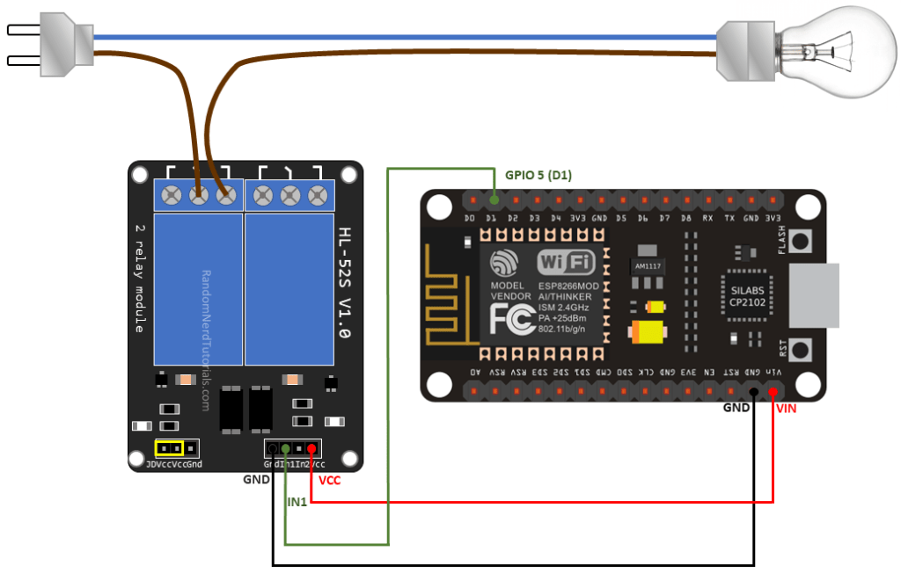

# Greenhouse water pump module

## Installing the USB to serial adapter driver

Download for MacOSX: https://sparks.gogo.co.nz/ch340.html
You need to reboot your computer after you have installes the driver.
You should now be able to connect to the following port: `/dev/cu.SLAB_USBtoUART`

## Deploying MicroPython firmware to the ESP8266 board

Please note that I had some problems uploading files with adafruit-ampy when my NodeMCU was flashed with esptool v 3.0.

```bash
$ pip install esptool==2.8
```

Erase the existing flash with:

```bash
$ esptool.py --port /dev/cu.SLAB_USBtoUART
```

Deploy the MicroPython image to your board:

```bash
$ esptool.py --port /dev/cu.SLAB_USBtoUART --baud 115200 --after no_reset write_flash --flash_mode dio 0x00000 /Users/mirko/Downloads/esp8266-20200911-v1.13.bin
```

Notice: Be sure that the ESP8266 board is not connectd to the arduino IDE, picocom or similar. This is to prevent error messages like `can not acces because the board is busy or already in use`

## Let ESP8266 connect to you router

The best solution would be, to put a connection function direct into your boot.py.

```python
# This file is executed on every boot (including wake-boot from deepsleep)
# import esp
# esp.osdebug(None)
import uos
import machine
import network
# uos.dupterm(None, 1) # disable REPL on UART(0)
import gc
# import webrepl
# webrepl.start()

import upip

def do_install():
    upip.install('picoweb')


def do_connect():
    sta_if = network.WLAN(network.STA_IF)
    if not sta_if.isconnected():
        print('connecting to network...')
        sta_if.active(True)
        sta_if.config(dhcp_hostname="greenhouse-satellite-03")
        sta_if.connect('xxx', 'xxx')
        while not sta_if.isconnected():
            pass
    print('network config:', sta_if.ifconfig())
    print('hostname: ', sta_if.config('dhcp_hostname'))


do_connect()
do_install()
gc.collect()
```

Now your ESP8266 can automatically connect to you Router.
I also changed the the hostname in this script.

See also the official docs for Network basics:
http://docs.micropython.org/en/latest/esp8266/tutorial/network_basics.html?highlight=sta_if#network-basics

## Installing the Adafruit MicroPython Tool (ampy)

ampy allows you to interact(e.g upload or download) with a CircuitPython or MicroPython board over a serial connection.

```bash
$ pip install adafruit-ampy
```

See also: https://learn.adafruit.com/micropython-basics-load-files-and-run-code/install-ampy

## Upload the code to the ESP8266 board

```bash
$ ampy --port /dev/cu.SLAB_USBtoUART put main.py
```

## Why are GPIO values reversed?

```golang
off = 1
on = 0
```

The reason why the values are reversed (off = 1 and on = 0) is described here: https://arduino.stackexchange.com/questions/54502/5v-relay-module

Or in short, most relays are delivered in normally closed (NC) mode. This means that the circuit is closed and the relay is activated. To switch to normally open (NO), i.e. to deactivate the relay, the trigger pin must be energized (1 / on). If the relay is then to be reactivated, i.e. the manget lever of the relay is to jump back again, the trigger pin must no longer carry current, i.e. (0 / off).

Therefore:

```
on = normally open(NO)

and

off = normally closed(NC)
```

The corresponding cable connections from (+) to the relay is as follows:

```
common              -> to the load (+)

normally open(NO)   -> to the power source (+)
```

You can also set the values correctly but then you have to change the cable connections as follows:

```
common -> to the consumer (+)

normally colsed(NC) -> to the power source (+)
```

This has the consequence that the consumer is switched on continuously in case of a defective or not connected NodeMCU module/trigger.

Since the consumer, in this case the watering pump, is to activate only briefly by the trigger, the values were simply swapped.

## wire


source: https://randomnerdtutorials.com/esp8266-relay-module-ac-web-server/
